# Context: Set Up your AI Coding Agent

Post-local context for `src/content/posts/set-up-your-ai-coding-agent.md`.
Site-wide vocabulary and voice live in the root `CONTEXT.md`.

## Post type

How-to at the spine (pick a tier, install, configure, run). An explainer section
folds in (Agent = Model + Harness) and an opinion lands near the end (the
tokens-per-second and quality verdict). One format, how-to, with the other two
as supporting sections. Do not switch format mid-post.

## Audience

Someone who already uses ChatGPT or Claude in a chat window, maybe copies code
snippets out of it, but has never run a coding agent like Cursor, Claude Code, or
Codex. They want to automate small day-to-day or work tasks. Tech readers who
already use agents get a memory-lane read; the general reader learns there is a
lot to do past the chat box. Pitch every explanation at the reader who knows less.

## Structure decisions

- **Hook**: one merged universal flow, so a coder and a non-coder both see
  themselves. Two concrete scenes sharing the same shape (chat gives the answer,
  you carry it out): asking for a function and pasting it into an editor, and
  pulling the same fields out of thirty invoices by hand. Closes on "There's a
  lot you can do past that text box."
- **No "you were the hands" prose**. That paragraph read as AI slop and was cut.
  Its one idea (the model answers, you do the doing, it never touches your work)
  is carried by a diagram plus a one-line caption instead.
- **Diagrams**: a matched pair. Diagram 1 (this phase) shows the chat-plus-human
  loop where every arrow to the real work passes through You. Diagram 2 (next
  phase) is the same layout with an Agent node that owns the loop. Same boxes,
  same positions, only the loop-owner moves. Both are `flowchart LR` with
  numbered edges (1..5).
- **Diagram delivery**: authored in mermaid, shipped as PNG screenshots instead
  of a runtime renderer. Two exports per diagram, one per theme, palette-matched
  to the site tokens. They live in `public/images/posts/<slug>/` and swap in the
  post via `.theme-light-only` / `.theme-dark-only` (CSS in `global.css`, keyed
  on `:root[data-theme]`). Naming: `diagram-<n>-<name>.<theme>.png`, e.g.
  `diagram-1-chat-loop.light.png` and `diagram-1-chat-loop.dark.png`. The mermaid
  source is kept below so the diagram can be regenerated.
- **Problem statement**: covers both barriers. What an agent does that chat
  can't, and which one to pick plus what it costs (including the "$200 a month"
  assumption). Ties the model-plus-harness mix to the premium-to-free structure.
- **Order**: premium down to free. Ending on free is the payoff.
- **Scope note**: written in phases. Everything past the hook (the two `##`
  sections) is a draft from an earlier phase, still to be revisited.

## Canonical terms

- **Coding agent**: a model given hands. Chat-only AI talks through a text box; a
  coding agent opens files, runs code, reads its own errors, and retries. Cursor,
  Claude Code, and Codex are the examples used.
- **Agent = Model + Harness**: the canonical framing. Model is the brain (the LLM
  you know from chat). Harness is everything wrapped around it that lets it act
  (the loop, tools, context, memory, instructions, guardrails). "Same brain, new
  body." Use this phrasing. The tier and budget angle depends on the reader
  grasping that model and harness mix independently.
- **Harness parts**: the six pieces inside the harness, for the deep-dive
  section. Loop, tools, context management, memory, instructions, guardrails. Can
  be taught as four (loop, tools, context, guardrails) with memory and
  instructions folded into context.
- **Tier**: a price band for a coding agent, from premium down to free. A tier is
  a chosen combination of model and harness at a given cost.

## Companion video

This Post pairs with the first YouTube video. Same title. The video carries the
tokens-per-second and quality test that written text can't show as well. Set
`videoUrl` on the Post once the video is live.

## Diagram source

Regenerate the Diagram 1 screenshots from these. Paste into mermaid.live, export
PNG with a transparent background at 2x scale, save with the names above.

Light (`diagram-1-chat-loop.light.png`):

```mermaid
%%{init: {'theme':'base','themeVariables':{'fontFamily':'Inter, system-ui, sans-serif','lineColor':'#8a7a63','primaryTextColor':'#25201b'}}}%%
flowchart LR
    Model(["ChatGPT / Claude"])
    You(["You"])

    subgraph Workspace["Your workspace"]
        direction TB
        Editor["Code editor"]
        Terminal["Terminal"]
        Sheet["Spreadsheet"]
        Files["Files and folders"]
    end

    You -->|"1. describe the task"| Model
    Model -->|"2. answer: code, steps, a formula"| You
    You -->|"3. paste, run, edit, rename, all by hand"| Workspace
    Workspace -->|"4. result or error"| You
    You -->|"5. paste the error back"| Model
    Model -.->|"can't reach in here"| Workspace

    style Workspace fill:#fdf9f0,stroke:#c3b393
    linkStyle 5 stroke:#a83e2b,stroke-width:1.5px,stroke-dasharray:6 4
    classDef human fill:#efe4cf,stroke:#8a4423,stroke-width:1.5px,color:#25201b;
    classDef model fill:#f3ead9,stroke:#a8895f,stroke-width:1.5px,color:#25201b;
    classDef work fill:#faf4e8,stroke:#c3b393,color:#4a4239;
    class You human;
    class Model model;
    class Editor,Terminal,Sheet,Files work;
```

Dark (`diagram-1-chat-loop.dark.png`):

