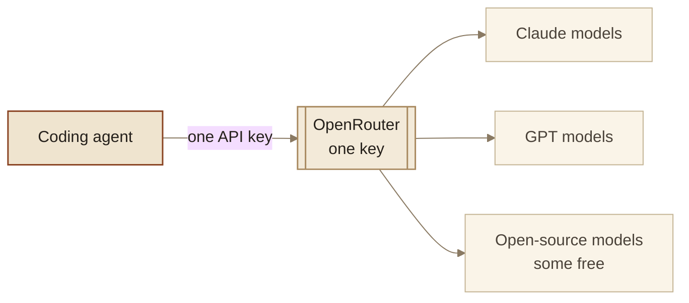
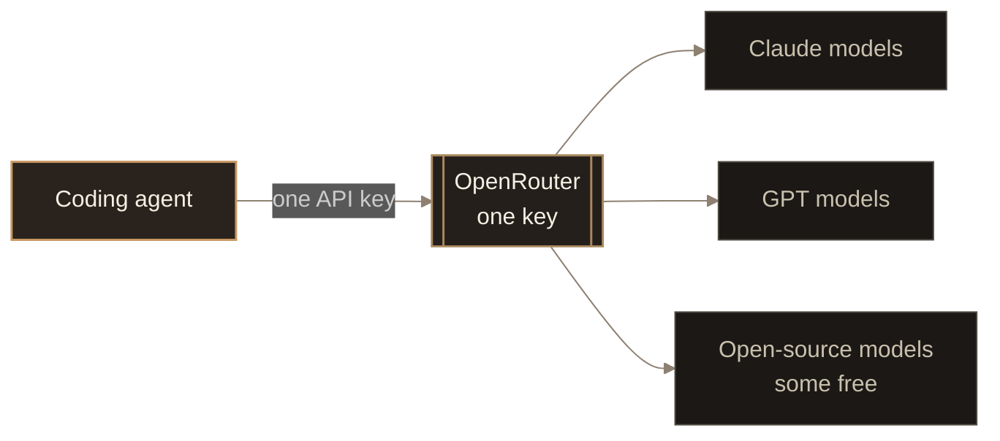
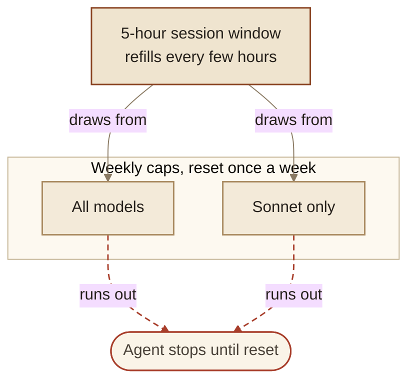

# Context: Set Up your AI Coding Agent

Post-local context for `src/content/posts/set-up-your-ai-coding-agent.md`.
Site-wide vocabulary and voice live in the root `CONTEXT.md`.

## Post type

How-to at the spine (pick a tier, install, configure, run). An explainer section
folds in (Agent = Model + Harness) and an opinion lands near the end (the
tokens-per-second and quality verdict). One format, how-to, with the other two
as supporting sections. Do not switch format mid-post.

## Audience

Someone who already uses ChatGPT or Claude in a chat window, maybe copies code
snippets out of it, but has never run a coding agent like Cursor, Claude Code, or
Codex. They want to automate small day-to-day or work tasks. Tech readers who
already use agents get a memory-lane read; the general reader learns there is a
lot to do past the chat box. Pitch every explanation at the reader who knows less.

## Structure decisions

- **Hook**: one merged universal flow, so a coder and a non-coder both see
  themselves. Two concrete scenes sharing the same shape (chat gives the answer,
  you carry it out): asking for a function and pasting it into an editor, and
  pulling the same fields out of thirty invoices by hand. Closes on "There's a
  lot you can do past that text box."
- **No "you were the hands" prose**. That paragraph read as AI slop and was cut.
  Its one idea (the model answers, you do the doing, it never touches your work)
  is carried by a diagram plus a one-line caption instead.
- **Diagrams**: a matched pair. Diagram 1 (this phase) shows the chat-plus-human
  loop where every arrow to the real work passes through You. Diagram 2 (next
  phase) is the same layout with an Agent node that owns the loop. Same boxes,
  same positions, only the loop-owner moves. Both are `flowchart LR` with
  numbered edges (1..5).
- **Diagram delivery**: authored in mermaid, shipped as PNG screenshots instead
  of a runtime renderer. Two exports per diagram, one per theme, palette-matched
  to the site tokens. They live in `public/images/posts/<slug>/` and swap in the
  post via `.theme-light-only` / `.theme-dark-only` (CSS in `global.css`, keyed
  on `:root[data-theme]`). Naming: `diagram-<n>-<name>.<theme>.png`, e.g.
  `diagram-1-chat-loop.light.png` and `diagram-1-chat-loop.dark.png`. The mermaid
  source is kept below so the diagram can be regenerated.
- **Problem statement**: covers both barriers. What an agent does that chat
  can't, and which one to pick plus what it costs (including the "$200 a month"
  assumption). Ties the model-plus-harness mix to the premium-to-free structure.
- **Order**: premium down to free. Ending on free is the payoff.
- **Setting It Up is repeated per tier, in full**. Every tier section carries its
  own complete `[agent] × [OS]` tabset, including install steps identical to the
  other tiers. Chosen deliberately: the post is a tier ladder and readers jump
  straight to the band they can afford, so a section that says "scroll up to
  install" fails the reader it was written for. Accepted cost: roughly four
  copies of the same install block by the end of the post, kept in sync by hand.
  If an install command changes, grep every tier section.
- **`codex login` is tier-scoped, not forbidden**. The API section currently says
  "Do not run plain `codex login`" (line 211). That is the right instruction for
  API billing and the wrong one for premium, where plain `codex login` is exactly
  the command. Because tier sections repeat in full, reword the API warning to
  scope it rather than ban it: signing in with a subscription is correct if you
  are on a paid plan, just not for API billing.
- **Each tier section's Catch names that tier's own failure**, and consecutive
  Catches mirror each other. API billing: there is no ceiling, so cost runs away.
  Premium: there *is* a ceiling, and you hit it mid-task, which is the worse
  failure because you cannot pay your way out of it. Shipped Catch is simpler
  than the original plan: it drops the numeric "hit the cap twice in a month"
  threshold and does not repeat the API-billing escape hatch, since that hatch
  already lives in the limits paragraph earlier in the section. Final shape is
  a straight two-way branch, heavy usage stays and starts at 5x, light usage
  moves to the next tier, matching a later brief that asked for exactly that and
  no more.
- **The post states, it does not analyse.** This is a how-to. Research findings
  belong in this context file, not in the prose. Specifically keep out of the
  post: provider-versus-provider verdicts (which is cheaper), currency
  comparisons (dollar prices versus rupee prices), plan history (what a tier used
  to cost or be called), and methodology caveats about where a number came from.
  The API section is the model to copy: it says "here is the pricing for popular
  models as of July 2026", shows the table, and moves on. A table plus one line
  of orientation beats a paragraph explaining what the table means. Cut anything
  a reader would skip to get to the setup steps.
- **Scope note**: written in phases. Everything past the hook (the two `##`
  sections) is a draft from an earlier phase, still to be revisited.

## Canonical terms

- **Coding agent**: a model given hands. Chat-only AI talks through a text box; a
  coding agent opens files, runs code, reads its own errors, and retries. Cursor,
  Claude Code, and Codex are the examples used.
- **Agent = Model + Harness**: the canonical framing. Model is the brain (the LLM
  you know from chat). Harness is everything wrapped around it that lets it act
  (the loop, tools, context, memory, instructions, guardrails). "Same brain, new
  body." Use this phrasing. The tier and budget angle depends on the reader
  grasping that model and harness mix independently.
- **Harness parts**: the six pieces inside the harness, for the deep-dive
  section. Loop, tools, context management, memory, instructions, guardrails. Can
  be taught as four (loop, tools, context, guardrails) with memory and
  instructions folded into context.
- **Tier**: a price band for a coding agent, from premium down to free. A tier is
  a chosen combination of model and harness at a given cost.
- **Section title pattern**: `The [X] Option: Coding Agents on [Y] Billing`.
  First two titles named the tier's downside: "The Infinite Spend Option:
  Coding Agents on API Billing", "The High Cost Option: Coding Agents on
  Premium Billing". Third title breaks that on purpose: "The Entry-Level
  Option: Coding Agents on Standard Billing". Entry is the tier the post steers
  readers toward, so the first slot goes neutral (names the tier, not a
  downside or a benefit) rather than force a cost complaint that would not be
  honest. Keep this pattern in mind for the free tier's title too: decide
  deliberately whether it names a downside (limited models, local setup) or
  stays neutral, rather than defaulting to the first two titles' shape.
- **Ladder stays monotonic**: the post already calls API billing "the costliest"
  (line 47) and "the most expensive option" (line 275). Every later section must
  position itself as a step *down* from the one before, never restate cost in
  absolute terms, or the titles start contradicting the ladder.
- **Premium tier**: the flat-fee subscription band that sits below API billing.
  Both providers converged on the same shape at the same prices, so the post
  treats it as one decision, not two. Entry tier at $20 (Claude Pro, ChatGPT
  Plus), then **5x** at $100 and **20x** at $200. The multiplier is against the
  entry tier, not against each other.
- **Plan naming**: "Claude Max 5x" / "Claude Max 20x" and "ChatGPT Pro 5x" /
  "ChatGPT Pro 20x". Never "Codex Pro". Codex is a harness; the thing you buy is
  a ChatGPT Pro plan that Codex runs on. Naming the subscription after the agent
  collapses the Agent = Model + Harness distinction the post spends a diagram
  establishing. Phrase it as "Codex runs on a ChatGPT Pro plan; Claude Code runs
  on Claude Max."
- **Stacked limits**: premium plans meter usage with three limits, not two. A
  rolling ~5-hour **session window** that refills, a **weekly cap** across all
  models that drains until reset, and a **per-model weekly cap** that drains
  separately. On Claude that third cap is **Sonnet-only** (Anthropic's wording:
  one weekly limit across all models, another for Sonnet models only). Refill and
  drain are different behaviours and the post must not blur them. The failure a
  reader actually hits is the third: exhausting the per-model cap while the
  all-model cap still looks healthy, so the agent stops for a reason the
  dashboard does not make obvious. Taught with Diagram 5
  (`diagram-5-limits.{light,dark}.png`), stacked buckets, session window on top
  drawing from the weekly tanks below.
- **Usage allowance**: how much work a premium plan buys before it cuts out.
  Reported in the vendor's own published unit (prompts per rolling 5-hour window,
  plus the weekly cap), broken out per model, because burn rate varies by model
  far more than by plan. Every figure is cited and dated. One extra column
  translates it into plain terms ("most of a workday"), marked clearly as an
  estimate. Never present a derived token or hour figure as if the vendor
  published it. Avoid the bare phrase "how much you get"; a prompt is not a unit
  of work, and one prompt can mean forty minutes of autonomous agent time.
  OpenAI's own ranges make that point: 15-90 messages for one model on one plan,
  a sixfold spread, because task size drives consumption more than plan does.
- **Provenance differs by vendor and must stay visible**. OpenAI publishes
  per-model ranges per 5-hour window on its Codex pricing page. Anthropic
  publishes no absolute numbers anywhere official, only the 5x/20x multiplier
  against Pro, and points users to Settings > Usage. Decision: fill the Claude
  rows from third-party estimates rather than leave them blank, but mark every
  such figure as a community estimate carrying its source and the date it was
  read, and keep a line saying Anthropic does not publish these. Use measured
  third-party figures **as reported**; do not derive the Max rows by applying
  Anthropic's 5x/20x multiplier to a Pro baseline. Measurement says the
  multiplier does not hold uniformly (see below), so a derived table would be
  internally tidy, wrong, and in conflict with its own cited sources. Weekly caps
  for ChatGPT are unquantified by OpenAI; leave those unfilled rather than
  estimating them.
- **Every model is available on every paid plan**, including Opus on Pro.
  Anthropic's own pricing page feature table checks Fable, Opus, Sonnet and Haiku
  across Free, Pro, Max 5x and Max 20x. Third-party guides claiming Pro has no
  Opus are wrong; cite claude.com/pricing for model access, never a blog. Plans
  differ by how much you get, not by which models you can reach.
- **The multiplier is real per session and not per week.** Anthropic's claim is
  carefully scoped to "more usage per session", and per 5-hour window the
  community numbers agree with it exactly: Pro ~10-45 prompts, Max 5x ~50-225,
  Max 20x ~200-800. Clean 5x and 20x. The weekly cap is where it stops scaling,
  measuring closer to 1.7x between Max 5x and Max 20x. So the section's finding
  is not "the multiplier is a lie". It is sharper and fairer: **the session
  multiplier is honest, the weekly cap is what actually stops you, and that one
  does not scale with the price.** This is the strongest original point in the
  section and it is what justifies the start-at-5x rule in The Catch. Report
  weekly behaviour as direction rather than decimals, since the underlying
  figures disagree, and never offer the table as a budgeting tool.
- **Claude per-model figures are estimated, by a stated method.** No source
  publishes or measures per-model prompt counts for Claude, so the breakdown is
  derived rather than cited, and the post must say so in plain words. Method:
  anchor Sonnet to the one figure sources agree on (10-45 prompts per 5-hour
  window on Pro), spread the other sizes using the S:M:L ratios OpenAI actually
  publishes (roughly 3.3 : 1.33 : 1) rather than a raw inverse of API price,
  which overstates the spread, extend Fable past Opus on its 2x price step, then
  multiply by 5 and 20 for the Max tiers. Independent check: the method yields
  200-900 for Max 20x Sonnet against a community-measured 200-800. Re-derive
  from this recipe rather than patching individual cells when prices move.
- **Drop the "hours per week" figures entirely.** Blogs report Claude weekly
  allowances as hours (140-280 Sonnet on Max 5x, 240-480 on Max 20x), but a week
  holds 168 hours, so those cannot be wall-clock and the sources never define
  what they mean. Unusable for a beginner audience who will read them literally.
  Use prompts per 5-hour window as the single Claude unit.
- **Two gotchas were cut from the shipped draft.** claude.ai chat and Claude
  Code sharing one allowance, and Claude's Opus-to-Sonnet auto-downgrade at ~20%
  remaining, are both real and both still true, but a later, leaner brief asked
  to avoid over-explanation, so neither made the final section. Only the
  Sonnet-only weekly cap survived, folded into a single clause rather than its
  own paragraph, because it is the one a reader is actually likely to hit. If a
  future pass wants the other two back, they belong here, not as new research.
- **The "Feels like" idea shipped as one paragraph, not a second table.** A
  later brief listed the section's required tables explicitly (pricing,
  per-model allowance) and did not include a feels-like table, so the plain-
  language anchor was folded into a short paragraph right after the allowance
  table instead: one line per tier (entry / 5x / 20x), no separate table
  structure. Keeps the "hard idea needs a picture" requirement without adding a
  table beyond what was asked for.
- **INR pricing**: Anthropic localised Claude pricing to rupees on 13 July 2026,
  so both providers now list real India prices rather than card-rate conversions.
  Quote INR as **the amount actually charged** on both sides, with a note saying
  so. Verified July 2026: Anthropic states its rupee prices include GST, and
  OpenAI appears not to add GST on top (the listed figure is the final charge),
  so the two are already comparable and no normalisation is needed. Restate that
  check if either vendor changes, but do not assert a GST gap that is not there.
  The real finding is that ChatGPT undercuts Claude at both premium tiers in
  rupees while the two are level in dollars, so the India answer differs from the
  US answer. That is the sentence worth writing.
- **OpenAI tier split date**: ChatGPT Pro was a single $200 plan until 9 April
  2026, when it split into Pro 5x ($100) and Pro 20x ($200); existing Pro
  subscribers moved to 20x. Worth one sentence, since readers who bought Pro
  earlier will not recognise the new names.

## Entry-Level section

Third tier section, Claude Pro and ChatGPT Plus. Tabset IDs use an `e` prefix
(`eagent-cc`/`eagent-cx`, `ecc-mac/win/lin`, `ecx-mac/win/lin`), matching the `p`
prefix pattern from Premium. CSS selectors for these live in
`src/pages/posts/[...slug].astro` alongside the `p`-prefixed ones, added by hand
since there is no scaffolding-ahead-of-content step for this tier.

No new pricing or usage-limit explanation in this section. The brief for it was
explicit that pricing and limits were already covered in Premium (the combined
6-row table already includes Claude Pro and ChatGPT Plus at $20), so this
section only bridges to it and moves straight to setup.

Free-to-paid asymmetry, stated in the section: Claude Code requires a paid plan,
there is no free tier for it, so a free Claude user must upgrade to Pro to use
Claude Code at all. Codex is different: free ChatGPT already includes some
Codex access, and Plus expands it rather than unlocking it. Setting It Up
mirrors this (Claude pane frames Pro as required, Codex pane frames Plus as an
upgrade from existing access), and `codex login` here is the plain sign-in,
same as Premium, since Entry is also a subscription tier rather than API
billing.

The Catch is about interaction sources, not usage tiers: claude.ai chat and
ChatGPT chat both draw on the same usage limits as the coding agent, so mixing
chat and agent use eats into one pool without the reader noticing why. The fix
offered is behavioural (pick one interaction surface, do research and
implementation in the same coding-agent session) rather than a plan upgrade,
which is a different shape of Catch than API billing's or Premium's.

## Zero-Cost section

Fourth and final tier, title locked: "The Zero-Cost Option: Coding Agents on
OpenRouter". Breaks from the downside-first pattern the same way Entry-Level
did, on purpose: this is the tier the post has been building toward as the
payoff (see "Order: premium down to free" above), so the title stays plain
rather than leading with a downside. The honest tradeoffs (rate limits, weaker
models, no guarantees) belong in this section's Catch, not its title, mirroring
how Entry-Level's title stayed neutral while its Catch carried the real nuance.
Second slot names the mechanism directly ("OpenRouter"), not a billing type,
since nothing is actually being billed, same logic as tier 1 naming "API
Billing" as the mechanism being configured.

Uses OpenRouter, which already appeared unexplained in diagram 3's alt text
("Claude, ChatGPT, Open Router, or a local model through Ollama"). This section
opens that box slightly.

OpenRouter explanation locked on the universal-adapter analogy, chosen over a
food-delivery-app or freelancer-marketplace alternative. The analogy is weaker
at explaining why some models are free, so the free fact is stated plainly
afterward rather than stretched into the metaphor:

> OpenRouter works like a universal power adapter. Instead of a separate plug
> for every provider, you use it to reach Claude, GPT, and a long list of
> open-source models with the same one key.
>
> Some of the models behind it don't charge anything at all.

Diagram 6 wired into the post at `diagram-6-openrouter.{light,dark}.png`,
figure markup in place, images not yet exported (user said they will add these
themselves, same as the diagram-4 flow). Mermaid source below regenerates it.

### Setting It Up: Claude Code and Codex via OpenRouter, verified July 2026

Researched against primary sources before writing, since wrong env vars or
config here is a functional bug for readers, not a wording issue. Full source
list in the research below; key facts, in case they need re-verifying later:

- **Claude Code → OpenRouter is an OpenRouter-side integration, not an
  Anthropic-documented one.** Anthropic's own docs name `ANTHROPIC_BASE_URL`
  generically (for Bedrock/Vertex/proxies) but never mention OpenRouter
  specifically. Env vars: `OPENROUTER_API_KEY`, `ANTHROPIC_BASE_URL` set to
  `https://openrouter.ai/api` (**no `/v1`**, that's OpenRouter's separate
  OpenAI-compatible route), `ANTHROPIC_AUTH_TOKEN` set to the OpenRouter key,
  and `ANTHROPIC_API_KEY` must be explicitly set to an empty string or Claude
  Code can silently fall back to real Anthropic auth.
- **OpenRouter's own docs say Claude Code "is only guaranteed to work with the
  Anthropic first-party provider."** Tool-use and thinking-block fidelity is
  not guaranteed for arbitrary non-Anthropic models routed through it. This is
  the one caveat kept as an inline `
` in the setup steps rather
  than cut for brevity, because skipping it risks a reader picking a free model
  and getting unreliable tool calls with no idea why.
- **Codex → OpenRouter is a `~/.codex/config.toml` entry**, user-level only
  (project-local `.codex/config.toml` ignores `model_provider` with a warning):
  `model_provider = "openrouter"`, a `[model_providers.openrouter]` block with
  `base_url = "https://openrouter.ai/api/v1"` (this one **does** need `/v1`)
  and `env_key = "OPENROUTER_API_KEY"`.
- **OpenRouter keys**: page is `openrouter.ai/keys`, prefix `sk-or-`
  (well-corroborated by secondary sources, not pulled verbatim from a static
  OpenRouter page since their docs are a client-rendered SPA).
- **Free models are denoted by a `:free` suffix** on the model slug. The free
  catalog rotates fast (one tracker saw it shrink ~20→15 models in nine days in
  late July 2026), so no specific free model name is hardcoded anywhere in the
  post. Setup steps send the reader to `openrouter.ai/models?max_price=0` to
  copy a live slug themselves. Rate limits on `:free` models: 20 req/min
  always, 50 free requests/day under $10 lifetime purchased credits, 1,000/day
  once past that (stays elevated even if balance later drops) — not yet used in
  the post's prose, but relevant if a Catch section covers OpenRouter's own
  limits later.

Light (`diagram-6-openrouter.light.png`):

Dark (`diagram-6-openrouter.dark.png`):

## Zero-Cost section: the three free models table

Researched 2026-07-30 against OpenRouter's live public models API
(`openrouter.ai/api/v1/models`, unauthenticated JSON), treated as ground truth
over scraped HTML or blog roundups, several of which recommended models that
are no longer free (`qwen/qwen3-coder:free`, `openai/gpt-oss-120b:free`,
`poolside/laguna-m.1:free`, any `z-ai/glm-*`, any `deepseek/*` — all paid-only
as of that date). The catalog churns fast; re-verify against the live API
before trusting any slug here, don't just trust this file.

Picked one model per maker, three total, per an explicit user constraint
("top 3, each from a different vendor"), out of five candidates the research
turned up as workable for coding-agent tool use:

- **Cohere `north-mini-code:free`** — purpose-built for agentic coding, tested
  against OpenCode/SWE-Agent per Cohere's own launch post, scored well on
  Artificial Analysis' Coding Index (Cohere's claim, not independently
  re-verified). Picked as the strongest overall.
- **Poolside `laguna-xs-2.1:free`** — a coding-agent-only startup's smaller/
  faster sibling model (`laguna-s-2.1:free` also exists, larger, not used here
  to keep to one model per maker). The *previous* version in this family
  (`laguna-m.1:free`, now delisted) was reported painfully slow by one
  benchmark; unconfirmed whether 2.1 still has that issue, which is why the
  table's "what to expect" cell tells the reader to time it themselves rather
  than asserting it's fixed.
- **NVIDIA `nemotron-3-super-120b-a12b:free`** — large general-purpose model
  marketed for agent/coding use. Passed over its bigger sibling
  (`nemotron-3-ultra-550b-a55b:free`, 1M context) because that one carries more
  unconfirmed risk flags (possible limited-time promo, slower, more likely to
  hit provider-side capacity 429s) with no offsetting benefit for a beginner's
  first try.
- Passed over entirely: `openai/gpt-oss-20b:free` (general-purpose, not
  coding-specialized, and its better-regarded 120B sibling is paid-only now).

Also confirmed: `openrouter/free` is a real, live meta-slug (OpenRouter's own
"Free Models Router," 200K context, auto-picks among current free models
supporting what the request needs). Not used in the table since the brief
asked for three specific, named models, but worth knowing as a hedge against
catalog churn if a future revision wants one slug that never goes stale.

**Model-switching mechanism, confirmed from primary docs:**
- Claude Code: `/model <slug>` typed directly, or `ANTHROPIC_MODEL=<slug>` env
  var. Works because `code.claude.com/docs/en/model-config` states Claude Code
  only validates a typed model name against Anthropic's own API; behind a
  custom `ANTHROPIC_BASE_URL` (which is exactly how the OpenRouter integration
  works), any string passes through unchecked. There is no dropdown of
  OpenRouter models in `/model` — the reader types the exact slug.
- Codex: persistent via the `model` field in `~/.codex/config.toml`, or a
  one-run override via `codex --model <slug>` / `-m <slug>` (confirmed in
  OpenAI's own Codex docs). A `/model` slash command exists in the interactive
  TUI too, but whether it accepts an arbitrary OpenRouter slug under a custom
  `model_provider` was **not** confirmed from a primary source — the post uses
  `--model` instead since that one is verified.

## Decision matrix (TL;DR)

Sits right after diagram 3 (the swap diagram), before the first `##` tier
section. Three columns only: Tier (linked to its section via Astro's
auto-generated heading id, e.g. `#the-entry-level-option-coding-agents-on-standard-billing`,
confirmed by running `pnpm dev` and inspecting the rendered `<h2>` ids since
Astro slugifies headings automatically with no plugin config needed), Price,
Best for. Row order matches the post's own reading order (API Billing, Premium,
Entry-Level, Zero-Cost), not resorted by price, so the matrix previews the post
instead of reordering it.

Entry-Level had a small "Start here" tag (`.start-here` in
`src/pages/posts/[...slug].astro`, styled after `.draft-badge`), removed after
the user asked for it to be cut. The row is plain now, no visual distinction
from the other three tiers in the matrix.

## References added

Full audit of external/internal reference opportunities done; only these three
were applied so far, the rest remain a to-do list (see the conversation for
the full table if revisiting):

- Premium's plan pricing table: one-line source citation was added right after
  the table (`claude.com/pricing` and `chatgpt.com/pricing/`), then removed
  again on request. Table now has no source citation, matching the API
  Billing pricing table, which also has none.
- Zero-Cost's opening sentence: "OpenRouter" now links to `openrouter.ai`
  (first bare mention of the product in prose; `openrouter.ai/keys` and
  `openrouter.ai/models?max_price=0` were already linked elsewhere for
  actions, this is the first plain reference link).
- Zero-Cost's second sentence: "a coding agent with API billing" links to the
  API Billing section anchor
  (`#the-infinite-spend-option-coding-agents-on-api-billing`). The lock-in
  paragraph a few lines below ("In the API Billing option, you are locked
  into...") still repeats the same comparison unlinked — left alone on
  purpose, since linking the same anchor twice in one short stretch reads as
  redundant.

Remaining candidates not yet applied: API Billing's per-token pricing table
has no source citation (Anthropic/OpenAI API pricing pages, exact URLs not
yet confirmed); Premium's usage-limits paragraph could cite
`support.claude.com/en/articles/14552983`; Premium's per-model prompt table
could cite OpenAI's Codex pricing page for the OpenAI rows; the three free
models in Zero-Cost's table could each cite their maker's announcement page;
the OpenRouter/Claude Code reliability note and the env-var/config.toml setup
blocks could cite the relevant OpenRouter cookbook and Anthropic/OpenAI docs
pages; Zero-Cost's Catch could cite `openrouter.ai/docs/api-reference/limits`
for the 20/min, 50/day figures. Internal candidates not yet applied: API
Billing's Catch → Premium anchor, Premium's intro → Entry-Level anchor,
Premium's Catch → Entry-Level anchor, Entry-Level's intro → Premium anchor,
Entry-Level's Catch → Premium anchor.

## Companion video

This Post pairs with the first YouTube video. Same title. The video carries the
tokens-per-second and quality test that written text can't show as well. Set
`videoUrl` on the Post once the video is live.

## Diagram source

Regenerate the screenshots from these. Paste into mermaid.live, export PNG with a
transparent background at 2x scale, save with the names above.

### Diagram 5, stacked limits

Not yet exported. `diagram-5-limits.light.png` and `diagram-5-limits.dark.png`
are referenced by the premium section and will 404 until these are generated.

Light (`diagram-5-limits.light.png`):

Dark (`diagram-5-limits.dark.png`):

```mermaid
%%{init: {'theme':'dark','themeVariables':{'fontFamily':'Inter, system-ui, sans-serif','lineColor':'#8f8172','primaryTextColor':'#f4f0e3'}}}%%
flowchart TB
    Session["5-hour session window<br/>refills every few hours"]

    subgraph Weekly["Weekly caps, reset once a week"]
        direction LR
        All["All models"]
        One["Sonnet only"]
    end

    Stop(["Agent stops until reset"])

    Session -->|"draws from"| All
    Session -->|"draws from"| One
    All -.->|"runs out"| Stop
    One -.->|"runs out"| Stop

    style Weekly fill:#161311,stroke:#3a352f
    linkStyle 2,3 stroke:#e07a55,stroke-width:1.5px,stroke-dasharray:6 4
    classDef refill fill:#2a231d,stroke:#c89761,stroke-width:1.5px,color:#f4f0e3;
    classDef drain fill:#241f1b,stroke:#a8895f,stroke-width:1.5px,color:#f4f0e3;
    classDef halt fill:#1c1815,stroke:#e07a55,stroke-width:1.5px,color:#c8c1ae;
    class Session refill;
    class All,One drain;
    class Stop halt;
```

### Diagram 1, chat loop

Light (`diagram-1-chat-loop.light.png`):

Dark (`diagram-1-chat-loop.dark.png`):

```mermaid
%%{init: {'theme':'dark','themeVariables':{'fontFamily':'Inter, system-ui, sans-serif','lineColor':'#8f8172','primaryTextColor':'#f4f0e3'}}}%%
flowchart LR
    Model(["ChatGPT / Claude"])
    You(["You"])

    subgraph Workspace["Your workspace"]
        direction TB
        Editor["Code editor"]
        Terminal["Terminal"]
        Sheet["Spreadsheet"]
        Files["Files and folders"]
    end

    You -->|"1. describe the task"| Model
    Model -->|"2. answer: code, steps, a formula"| You
    You -->|"3. paste, run, edit, rename, all by hand"| Workspace
    Workspace -->|"4. result or error"| You
    You -->|"5. paste the error back"| Model
    Model -.->|"can't reach in here"| Workspace

    style Workspace fill:#161311,stroke:#3a352f
    linkStyle 5 stroke:#e07a55,stroke-width:1.5px,stroke-dasharray:6 4
    classDef human fill:#2a231d,stroke:#c89761,stroke-width:1.5px,color:#f4f0e3;
    classDef model fill:#241f1b,stroke:#a8895f,stroke-width:1.5px,color:#f4f0e3;
    classDef work fill:#1c1815,stroke:#4f4a42,color:#c8c1ae;
    class You human;
    class Model model;
    class Editor,Terminal,Sheet,Files work;
```

